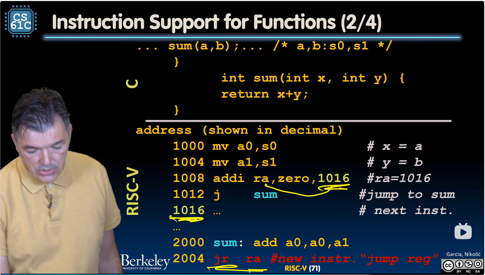

# Function calls

## Six fundamental steps in calling a function

1. Put arguments in a place where function can access them.
2. Transfer control to function.
3. Acquire (local) storage resources neede for function.
4. Perform desired task of the function.
5. Put *return value* in a place where calling code can access it and restore
   any registers you used; release local storage.
6. Return control to point of origin, since a function can be called from
   several points in a program.

## RISC-V function call conventions

- Registers is faster than memory, so use them.
- a0-a7 (x10-x17): eight argument registers to pass parameters and two return
  values (a0-a1).
- `ra`: one *return address* register to return to the point of origin (x1).
- s0-s1 (x8-x9) and s2-s11 (x18-x27): saved registers (more about those
  later).

## Example



### Jump register (`jr`)

Unconditionally jump to address specified in register.

We don't use `j` here, because it only supports to jump to a fixed place; but a
functions can be called anywhere, so it's not suitable to use `j`.

### Single instruction to jump and save return address: jump and link (`jal`)

It jumps to address and simultaneously saves the address of the **following**
instruction in register ra.

Before:
```asm
1008 addi ra, zero, 1016  # ra=1016
1012 j sum                # jump to sum
1016 ...

...

2000 sum: add a0, a0, a1
2004 jr ra                # Assembler shorthand: `ret`
```
After:
```asm
1008 jal sum  # ra=1002, goto sum
```
Advantages of `jal`:
- Make the common case fast: function calls very common.
- Reduce program size.
- **Don't have to know where code is in memory with `jal`.**

## Summary of instruction support

Actually, only two instructions:
- `jal  rd, Label` - jump and link, with `rd` default to `ra` (return adress
  register).
- `jalr rd, rs, imm` - jump and link register

`j`, `jr` and `ret` are pseudo instructions!
- `j Label` = `jal x0, Label`
- `jr rd`

## Old register values are placed into memory, before calling a function

Before calling functions, we have a lot of register being used, and executing
the function should take up those registers. So we should have some place to
store them, and they are **memory**.

Stack, a last-in-first-out (LIFO) queue, is ideal here.

`sp` is the *stack pointer* in risc-v (`x2`). It tells where the bottom of stack
frame is.

### Stack

Conventionally, stack begins on the top of memory and grows downwards.

Stack frame includes:
- Return address
- Parameters (arguments)
- Space for other local variables
