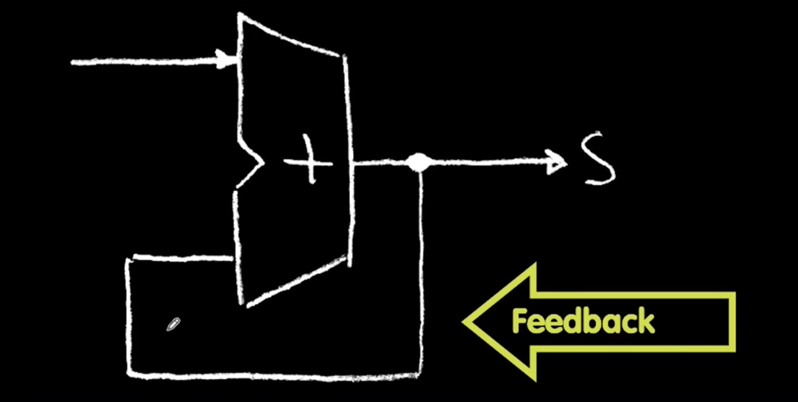
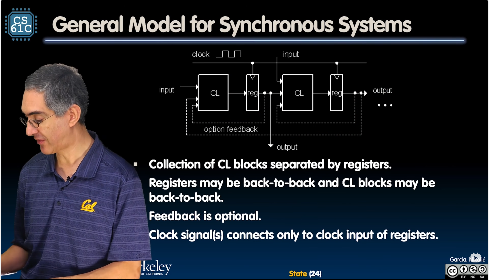

# State

This chapter descibes stateful circuits.

## Foreword

Before learning this chapter, you should first know the following list of
terminologies:
- Feedback, a phenomena where the outputs of a circuits are rounded back as its
inputs.

## State machine accumulator

Such a circuit doesn't work because:
- There is nothing to control the iteration of the `for` loop.
- We can't initialize the sum (to be 0).

So we need a register to hold the value.

## Register details: flip-flops

Explanations:
- Flip-flop name because the outoput flips and flops between 0 and 1.

- In D-type Flip-Flop:
    - CLK is "clock", used to load values.

    - D is "data"; Q is "output" (quiescent, stable).

### The timinig of a d-type flip-flop
See [The timinig of a d-type flip-flop](./timing-of-d-flip-flop.md).

## Pipelining
It's all about spliting and delegating works to different workers.

## Synchronous system

### Finite state machine
The definition can be found at <https://en.wikipedia.org/wiki/Finite-state_machine>.
But generally speaking, it's a system of states and transitions (between states).

### General model for synchronous systems

