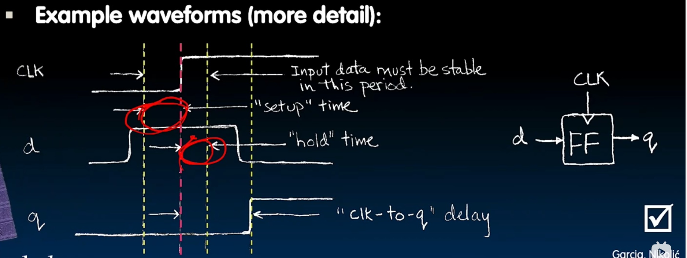

# Timing of d flip flop

- Edge-triggered d-type flip-flop
    - Rising edge-triggered
    ```
        +----
        | <--here
    ----+
    ```
    > On the rising edge of the clock, the input *d* is sampled and transferred
    > to the output. At all other times, the input *d* is ignored.

    

    Note the "setup" time, "hold" time, and "clk-to-q" delay. They are not
    official names.

    D should be stable in "setup" time, and "hold" time. And Q should be updated
    after a short delay of "clk-to-q".

## Recap of timing terms
- Clock (CLK): steady square wave that synchronizes system
- Setup Time: when the input must be stable *before* the rising edge of the CLK
- Hold Time: when the input must be stable *after* the rising edge of the CLK
- CLK-to-Q Delay: how long it takes the output to change, measured from the
  rising edge of the CLK
- Flip-flop: one bit of state that samples every rising edge of the CLK
  (positive edge-triggered)
- Register: several bits of state that samples on rising edge of CLK or on LOAD
  (positive edge-triggered)
