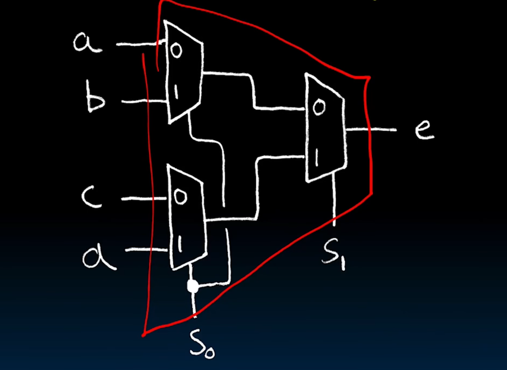
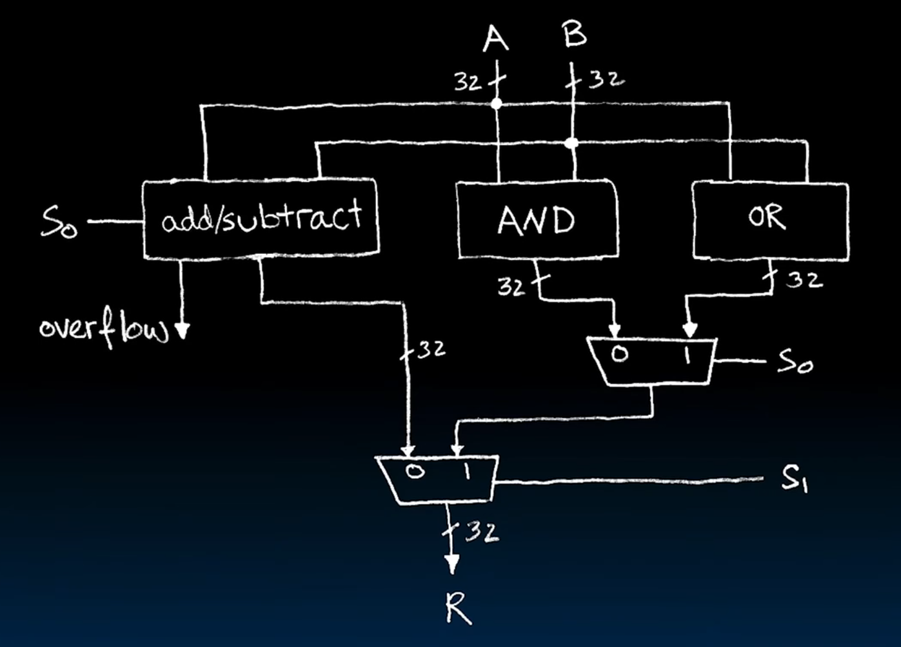

# Combinational logic blocks

## Data multiplexor

Also called data selector, lets some of the total data pass the 'bridge'.
(selects some of the data pass the bridge)

Basic data multiplexor is built from truth tables and boolean algebra, like:

1.  $e = \overline{s}a + sb$
1.  $e = \overline{s_1}\overline{s_0}a + \overline{s_1}s_0b + s_1\overline{s_0}c + s_1 s_0 d$
1.  ...

Hierachical data multiplexor is built from lower-level data multiplexor:

## Arithmetic and Logic Unit

Most processors contain a special logic unit called "Arithmetic and Logic Unit"
(ALU).

Let's see an easy example of ALU. Say we have A, B, S as inputs, and R as output
. And we want to achieve the following: 

*   When S=00, R=A+B.
*   When S=01, R=A-B.
*   When S=10, R=A&B.
*   When S=11, R=A|B.

What can we do?

A wise solution:

## Adder/Subtractor

To design an adder/subtractor, other than the 'get the truth table, get
canonical form, minimize it, build the circuits' process, we can look at
breaking the problem down into smaller pieces that we can cascade or
hierachically layer.

... (not finished, and probably will never be finished)

In summary, N 1-bit adders make up 1 N-bit adder/subtractor.
