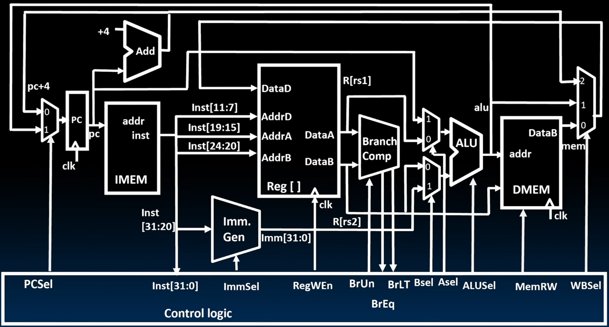

# Single-cycle CPU datapath

This documentation describes how to design the datapath inside CPU.

> Note: This is one of the implementations of datapath, but not the only one.

## RISC-V processor design

Old-school machine structure

New-school machine emphasizes on *parallelism*.

### Great idea #1: **Abstraction** (Levels of representation/interpretation)

From high level to low level:

*   High level language program (e.g., C)
    *   Compiler
*   Assembly language program (e.g., RISC-V)
    *   Assembler
*   Machine language program (RISC-V)
*   Hardware architecture description (e.g., block diagrams)
*   Logic circuit description (e.g., circuit schematic diagrams)

### The CPU

*   **Processor (CPU)**: the active part of the computer that does all the work
    (data manipulation and decision-making).
*   **Datapath**: portion of the processor that contains hardware necessary to
    perform operations required by the processor (the brawn).
*   **Control**: portion of the processor (also in hardware) that tells the datapath
    what needs to be done (the brain).

## Building a RISC-V processor

We can view CPU design as state machine design.

### Five stages of the datapath (five stages of execution)

1.  Instruction Fetch (IF) - happens in current rising edge
2.  Instruction Decode (ID)
3.  Execute (EX) - ALU
4.  Memory Access (MEM)
5.  Write Back to Register (WB) - happens in next rising edge

Note that 1. and 5. are running in the mean time!

### Register

A collection of flip-flops.

Three in's:

*   Write Enable (WE)
*   Data In
*   CLK

And one out:

*   Data Out

### Register file

A collection of registers.

## ???

... A lot of missing here.

## All 6 different types of datapaths to support instructions

Before supporting instructions of any formats, we first need a
**program counter** and a **fixed adder** in persuit of executing sequences of
instructions.

### R-type datapath

We need a **register file** to support fetching data from and storing data to.
And for `add`, one of the R-format instructions, an **ALU** is needed to support
adding calculation.

### I-type datapath

For `addi`, we need a **immediate generator** to support the generation of the
immediates. And we must introduce **multiplexors** to form datapath (which
enable selecting data from different source).

For `lw` and `sw`, though being two of the I-format instructions, they're the
only two instructions that access the memory. And we should take **memory** into
account.

*   For `lw`, we need another multiplexor to select written-back data, from ALU
    and the memory.
*   For `sw`, a **wire**, connecting and sending data to the memory, is needed.

### S-type datapath

### B-type datapath

#### Adding `jalr` to datapath

### J-type datapath

### U-type datapath

This is for upper-immediates (higher 20 bits, UI). Instructions to be supported:
`lui` (load upper-immediates) and `auipc` (add upper-immediates program counter)

### The complete single-cycle RV32I datapath

