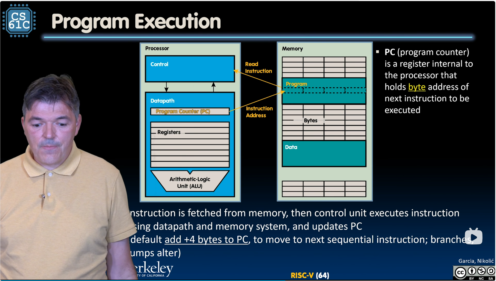

# Things about machine programs

## Assembler

They convert *human readable* `.S` (assembly code) files to *instruction bit
patterns*.

## Program execution

Here is an image showing the process of program execution:

Note that each instruction takes 32 bits in risc-v-32-bits.
